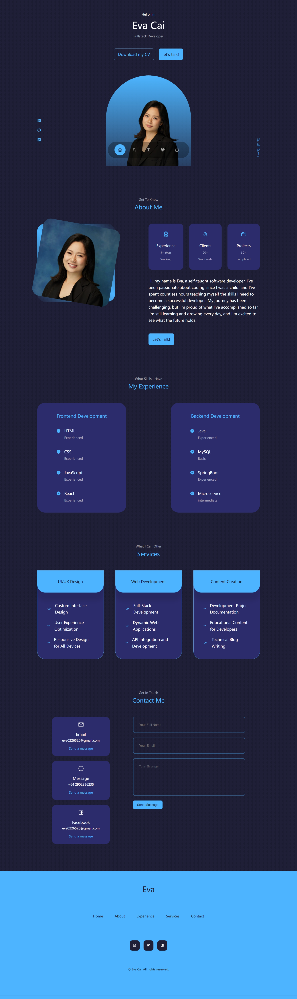

# Portfolio Introduction

This is the repository for my personal portfolio website showcasing my skills, projects, and experience in full-stack development.

## Features

- About Me section with personal introduction and skills overview
- Showcase of Services I offer
- Contact form for inquiries

## Technologies

- HTML
- CSS 
- JavaScript
- React
- Version control (Git)

## Getting Started

To get a local copy up and running follow these simple steps.

### Prerequisites

This project requires Node.js to run.

### `npm start`

Runs the app in the development mode.\
Open [http://localhost:3000](http://localhost:3000) to view it in your browser.

## Screenshots

-Desktop view 